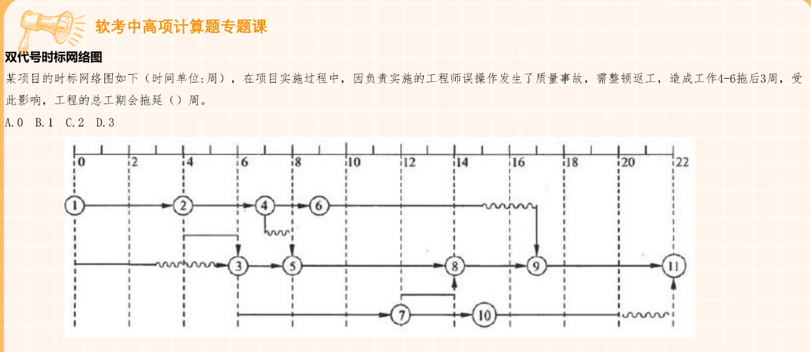

 这个笔记目的是将2022年准备系统集成项目管理工程师考试的思维导图转换为Markdown文本，起到复习作用，应对2023年5月份的考试。

# 1. 杂项概念题，一般是选择题

## 1.1. 狗屁概念

### 1.1.1. 信息系统建设务能力等级

1. 初始
2. 基本
3. 良好
4. 优秀
5. 杰出

### 1.1.2. 信息系统生命周期

1. 立项
2. 开发
   1. 最关键
   2. 包含：系统验收
3. 运维
4. 消亡

### 1.1.3. IT服务声明周期

1. 规划设计
2. 部署实施
3. 服务运营
4. 持续改进
5. 监督管理

### 1.1.4. 国家信息化

#### 1.1.4.1. 数字化转型

答案肯定要包含「数字化」

#### 1.1.4.2. 国家信息化体系6要素

1. 法规、标准 → 根本保障
2. 信息网络 → 基础设施
3. 信息技术应用 → 龙头
4. 信息资源 → 关键
5. 信息技术和产业 → 基础
6. 信息化人才 → 根本

#### 1.1.4.3. 《“十四五”信息化和工业化深度融合发展规划》

5大重点工程：

* 一是制造业数字化转型行动
* 二是两化融合标准引领行动
* 三是工业互联网平台推广工程
* 四是系统解决方案能力提升行动
* 产业链供应链数字化升级行动

### 1.1.5. 供应链

#### 1.1.5.1. 按物理结构分类

（上层是客户、产品，下层是供应商、原材料）

1. V型供应链：一种发散性网链结构，客户和产品的数量比供应商和原材料的数量要多，适用原材料单一、产品多样化的企业，例如化工、造纸和防治企业，这些企业的共同特点是业务复杂、库存量大、本土化经营性，供应链管理的要点是注重物流计划和调度，需要对关键性的内部能力进行合理安排，制定供应链成员统一计划。
2. A型供应链：一种会聚型网链结构，客户和产品比供应商和原材料少，企业为满足少数客户的需求，从众多供应商选择大量的物料，适用于航空工业、重工业等企业，重点是关注时间，保证物流同步，生产企业根据自己的ERP(企业资源计划)来安排原材料采购，生产出产品，递交到客户手中。
3. T型供应链：介于A型供应链和V型供应链之间，适用于客户、产品、供应商、原材料种类适中的企业，一般存在于最接近最终用户的行业中，例如汽车配件业、电子产品制造业等。其要点是根据现存订单确定通用件，通过制造标准来减少复杂度。

#### 1.1.5.2. 供应链特点

1. 交叉性
2. 动态性
3. 存在核心企业
4. 复杂性
5. 面向用户

#### 1.1.5.3. 供应链三个阶段

1. 初级萌芽
2. 形成
3. 成熟

### 1.1.6. 大数据

1. 数据采集
   1. 主要使用技术
      1. ETL
2. 数据存储
   1. 主要技术
      1. 结构化数据的存储与访问
      2. 非结构化数据的存储与访问
      3. 半结构化数据的存储与访问
3. 数据管理
4. 数据分析与挖掘

5V特点

* Volume（大量）
* Velocity（高速）
* Variety（多样）
* Value（低价值密度）
* Veracity（真实性）

关键技术

* 大数据存储管理技术：GFS、Hadoop、NoSQL、HBase
* 大数据并行计算技术与平台：MapReduce
* 大数据分析技术

### 1.1.7. 商业智能（Business Intelligence，BI）

**不是新技术。**

数据仓库+数据挖掘+联机分析处理（OLAP）+数据备份（恢复）

定义：企业对商业数据的搜集、管理和分析的系统过程，目的是使企业的各级决策者获得知识或洞察力，帮助他们做出对企业更有利的决策

定义：面向主题的、集成的非易失的、反映历史变化的数据集合，用于支持决策。

#### 1.1.7.1. 主要功能

1. 数据仓库
2. 数据ETL（Extract-Transform-Load）
3. 数据统计输出（报表）
4. 数据分析

#### 1.1.7.2. 实现层次

1. 数据报表
2. 多维数据分析
3. 数据挖掘

#### 1.1.7.3. 步骤

1. 需求分析
2. 数据仓库建模
3. 数据抽取
4. 简历商业智能分析报表
5. 用户培训和数据模拟测试
6. 系统改进和完善

### 1.1.8. 物联网架构

1. 感知层
   1. 传感器网络
   2. 传感器网关
   3. 摄像头
   4. 传感器
2. 网络层
   1. 物联网管理中心
   2. 物联网信息中心
   3. 2G、3G、4G网络
3. 应用层
   1. 绿色农业
   2. 工业监控
   3. 环境监测
   4. 智能家居
   5. ……

### 1.1.9. 中间件

1. 数据库访问
2. 远程过程调用
3. 面向消息：实现平台无关的数据传递
4. 事务
5. 分布式对象

### 1.1.10. 合同变更

原则：公平合理

步骤：

1. 先确定变更量清单，再确定变更价款
2. 合同中已有适用于项目变更的价格，按照已有价格变更
3. 和合同中只有类似项目变更的价格，参照类似价格变更
4. 没有类似项目变更价格，由承包人提出价格，监理工程师、业主确认后执行。

### 1.1.11. 标准化

#### 1.1.11.1. 标准制定的9个阶段

1. 准备
2. 立项
3. 起草
4. 征求意见
5. 审查
6. 批准
7. 出版
8. 复审
9. 废止

#### 1.1.11.2. 标准类别

* 国际
* 国家
* 区域
* 行业
* 地方
* 企业

#### 1.1.11.3. 一些标准组织缩写

* 中国国家标准化管理委员会（SAC，Standardization Administration of China）
* 国际标准化组织（ISO）：International Organization for Standardization
* 国际电工委员会（IEC）：International Electrotechnical Commission
* 美国国家标准协会（ANSI）：American National Standards Institute
* IEEE：电气和电子工程师学会（Institute of Electrical and Electronics Engineers）
* W3C：万维网联盟（World Wide Web Consortium）

### 1.1.12. 软件工程

#### 1.1.12.1. 常用开发方法

* 瀑布
* 迭代
* 敏捷
* V模型
* 原型
* 螺旋
* 面向对象
  * 严格的模块化，强调共享、复用
  * 类是对象的抽象，对象是类的具体实例
  * 封装
  * 继承
  * 多态
  * 接口
  * 消息和方法
  * 软件复用
  * 抽象
* 结构化
  * 整个系统分为若干阶段。
  * 需要在开发之处就全面了解需求，充分分析各种情况。

#### 1.1.12.2. 迭代模型（统一软件开发过程RUP（Tational Unifidd Process)）

软件生命周期分为4个阶段

1. 初始
2. 细化
3. 构建
4. 交付

核心过程工作流的从上到下迭代

1. 商业建模
2. 需求分析
3. 分析设计
4. 部署

#### 1.1.12.3. 分布式应用

软件架构设计需要考虑

* 数据库选择
* 用户界面选择
* 灵活性和性能
* 技术选择
* 人员

### 1.1.13. 提升云计算自主创新能力

* IaaS：Infrastructure as a Service基础设施即服务
* Paas：Platform as a Service平台即服务
* SaaS：Software as a Service软件即服务

不属于自主创新：引导云计算中心的区域部署。

### 1.1.14. CRM：Customer Relationship Management客户关系管理

* 以客户为中心
* 支柱性功能
  * 市场营销
  * 客户服务
* 构成
  * 触发中心
  * 挖掘中心

用户对产品使用情况的调查数据属于：促销性数据。

### 1.1.15. SOA与Web Service

* SOA：Service-Oriented Architecture（面向服务的体系结构）
* Web Service
  * 三种工作角色
    * 服务提供者（服务器）
    * 服务请求者（客户端）
    * 服务注册中心
  * SOAP：Simple object Access Protocol（简单对象访问协议）
  * WSDL：Web Service Desciption Language（web服务描述语言）
  * UDDI：Universal Description, Discovery and Integration（通用描述、发现与集成服务）
    * 用于
      * 服务注册
  * Web服务是实现SOA的方式之一，换句话说Web Service让SOA真正得到了应用

### 1.1.16. 计算机网络分类

* 按分布范围分类
  * 局域网
  * 城域网
  * 广域网
* 按拓扑结构
  * 总线型——在计算网络中在主导地位
  * 星型
  * 环型
* IEEE 802.3 - 以太网协议
  * 10M 以太网
    * 10Base5、10Base2：同轴粗缆
    * 10Base-F、星型网络：光纤
    * 10Base-T、是星型网络：非屏蔽双绞线
  * 100M 以太网
    * 100Base-TX：5类非屏蔽双绞线、1，2类STP
    * 100Base-FX：62.5/125多模光纤
    * 100Base-T4：3类非屏蔽双绞线
  * 1000M 以太网
    * 1000Base-LX：多模光纤或单模光纤、最大距离5000m
    * 1000Base-SX：多模光纤、最长550m（50um）/275m(62.5um)
    * 1000Base-T：5类UDP、最长100m
  * F：光纤      T：双绞线
* UTP：非屏蔽双绞线
  * 无金属屏蔽材料只有一层绝缘胶皮包裹，价格便宜，组网灵活，阻燃效果好，不容易火灾
* IEEE 802.11 - 最初无线局域网标准：速率最高只能2MB/s，WiFi6也属于。
* IEEE 802.11a（Wi-Fi 5）：物理层速率54mb/s，传输层可达25mb/s
* IEEE 802.11b：所有无线局域网中最著名、普及最广的标准

## 1.2. 不算太狗屁概念

### 1.2.1. 信息安全

#### 1.2.1.1. 信息安全的基本要素（信息系统审计的关注点）

1. 保密性
   1. 信息不会暴露给未授权的实体或进程
2. 完整性
   1. 授权人才能修改数据，且能够识别出来数据是否被篡改
   2. 确保完整性的方法
      1. 数字签名
      2. 协议
      3. 纠错编码
      4. 密码校验和方法
      5. 公证
3. 可用性
   1. 授权人可访问数据，攻击者不会占用资源、妨碍工作
4. 可控性
   1. 控制授权范围
   2. 控制授权行为
5. 可审查性
   1. 有安全调查的依据和手段
6. 不可抵赖性

**一般至少填第1-3项**

#### 1.2.1.2. 典型网络攻击步骤

1. 信息收集
2. 寻找突破口
3. 实施攻击
4. 消除记录
5. 保留访问权限

#### 1.2.1.3. 人员离岗安全管理

1. 基本要求
   1. 终止各种访问权限
   2. 收回各种证件、密匙、设备
2. 调离后的保密要求
   1. 上述基础上
   2. 管理层、信息岗位关键人员，必须严格办理手续，承诺保密要求。
3. 离岗的审计要求
   1. 上述基础上
   2. 管理层、信息岗位关键人员，必须进行离岗安全审查，在规定的脱密期限后，再调离。
4. 关键部位人员的离岗要求
   1. 上述基础上
   2. 按照机要人员管理办法办理

#### 1.2.1.4. 信息系统安全保护等级

|                    | 国家安全               | 社会次序和公共利益     | 公民、法人 |
| ------------------ | ---------------------- | ---------------------- | ---------- |
| 用户自主保护       |                        |                        | 损害       |
| 系统审计           |                        | 损害                   | 严重损害   |
| **安全标记** | **损害**         | **严重损害**     |            |
| **结构化**   | **严重损害**     | **特别严重损害** |            |
| **访问验证** | **特别严重损害** |                        |            |

国家 → 社会公共 → 公民法人

五四三 → 四三二 → 二一

#### 1.2.1.5. 机房防静电

1. 接地与屏蔽
2. 服装防静电
3. 温湿度防静电
4. 地板防静电
5. 材料防静电
6. 维修MOS电路暴保护
7. 静电消除要求

### 1.2.2. 项目付款合同分类

1. 总价合同
   * 固定总价，一开始就确定价格，不允许改变
2. 总价加激励合同
   * 允许一定绩效偏差，对实现既定目标给予奖励
3. 总价加经济价格调整合同
   * 卖方履约要花费很长时间（数年），则使用该合同。
4. 订购单
   * 非大量采购标准化产品，通常买方直接填写卖方提供的订购单，卖方供货。
   * 不需要谈判，又称单边合同。
   * 好像就是类似个人消费者买东西嘛。
5. 成本补偿合同
   * 发包人向承包人支付全部合法成本之后，按照事先约定的某种方式再外加一笔作为利润。
   * 适用于
     1. 需要立刻开展工作的项目
     2. 对项目内容、技术经济指标未明确的项目
     3. 风险大的项目
   * 细分类别
     1. 成本加固定费用：给一笔固定费用
     2. 成本加激励费用：达到合同规定的绩效目标，则给预先确定的激励费用
     3. 成本加奖励费用：买方凭主观感觉给一笔钱，卖方通常无权申诉。
6. 工料合同
   * 承包商负责项目的全部工作，包括设计、采购、施工以及通常包含试运行等服务。承包商需要对项目的完成时间、成本和质量负责。
   * （没明白和总价合同有什么区别）

### 1.2.3. 承包合同类型

* 总承包合同
  * 一个总承包商负责，可能会由其再分包。
* 分包合同
  * 总承包商和分包商之间签订，不需要发包人同意。
* 单项工程承包
  * 有利于吸引较多承包人参与竞争。
* 总价合同
  * 是以上三种承包方式的一种付款方式。
  * 适用于工程量不太大、能精确计算风险的项目。

### 1.2.4. OSI模型

1. 应用层
   1. HTTP、SMTP、FTP
2. 表示层
   1. 各种文件格式，JPEG、GIF等
3. 会话层
   1. SQL
4. 传输层
   1. TCP、UDP、SPX
5. 网络层
   1. IP、ARP
6. 数据链路层
   1. IEEE802.3
7. 物理层
   1. RJ45

其他地方整理的：

分层及其协议：

* 应用层
  * POP3：邮件收发协议，是Internet电子邮箱的第一个离线协议
  * FTP：用于Internet上的文件双向传输
  * Telnet：是Internet远程登陆服务的标准协议和主要方式
  * HTTP：客户端浏览器或其他程序与Web服务器之间的应用层通信协议
  * SMTP：一种提供可靠且有效电子邮件传输的协议，建立在FTP文件传输服务上的一种邮件服务
  * NFS：允许一个系统在网络上与他人共享目录和文件
  * DHCP：局域网网络协议，使用UDP协议工作，为内部网络或网络服务供应商自动分配IP地址，给用户、内部网络管理员作为对所有计算机做中央管理的手段
  * SNMP：前身是SGMP，使用SGMP进行网络管理需要管理基站、管理代理、MIB和网络管理工具
  * TFTP：用来在客户机与服务器之间进行简单文件传输的协议
  * DNS：解析器，域名服务器，保存有该网络中所有主机的域名和对应IP地址，并具有将域名转换为IP地址功能的服务器，域名必须对应一个IP地址，而IP地址不一定有域名，采用类似目录树的等级结构，
* 传输层
  * TCP - 可靠
    * 一种面向连接（连接导向）的、可靠的、基于字节流的传输层通信协议
    * TCP建立连接之后，通信双方可以同时进行数据的传输，TCP是全双工的
    * 在保证可靠性上，采用超时重传和捎带确认机制
  * UDP - 不可靠
    * 面向事务的简单不可靠的信息传送服务
    * 是一个无连接协议，传输数据之前源端和终端不建立连接
    * 在网络不满意环境下，丢包严重
    * 资源消耗小、梳理速度快
    * QQ就是使用的UDP协议
* 网络层
  * IP：Internet Protocol网络协议
    * 不同帧统一转换成IP数据包格式，并给Internet上的每个计算机和其他设备都规定了一个唯一地址，IP地址
  * ICMP: 互联网控制报文协议
  * IGMP：internet组管理协议
  * ARP：地址解析协议
    * 实现通过IP地址得知其物理地址
    * 以以太网环境为例，为了正确地向目的主机转送报文，必须把目的主机的32位IP地址转换为48位以太网地址
  * RARP：反向地址解析协议
* 网络接口层
  * CSMA/CD
    * 带有冲突监测的载波侦听多路访问
      * 载波侦听：网络上各个工作站在发送数据前都要侦听总线上有没有数据传输
      * 多路访问：网络上所有工作站收发数据共同使用同一条总线，且发送数据是广播式的
      * 冲突：若网上有两个或两个以上工作站同时发送数据，在总线上就会产生信号的混合，哪个工作站都辨别不出真正的数据是什么，这种情况的数据冲突又称碰撞
      * 冲突检测：为减少冲突影响，在发送过程中还要不停检测自己发送的数据有没有冲突
    * 应用最多的就是以太网
  * TokingRing
    * 令牌环网 IEEE 802.5 LAN协议

### 1.2.5. 虚拟现实的典型特征

* 沉浸性
* 交互性
* 多感知性
* 构想性
* 自主性

### 1.2.6. 自动驾驶

L1 驾驶辅助

车辆仍由驾驶员控制，车辆具备一些初级驾驶辅助功能。这个其实现在很常见，例如定速巡航、自动泊车就可以划分到这一类，只是可以起到一个辅助的作用，驾车主力还是驾驶员。

L2 部分自动化

车辆具备了自动驾驶的多项功能，驾驶员仍需主导驾驶，L2等级目前是市面大多新车型搭载的自动驾驶系统。

L3 有条件自动化

驾驶员可以稍息下，但仍需紧绷神经时刻观察，得像监考老师的鹰眼一般，做好接手驾驶的准备，所以叫有条件的自动化，这里驾驶员的重要性已经在降低。

L4 高度自动化

这里车辆就几乎达到了替代驾驶员的情况，就像出师的徒弟一般，驾驶员大哥可以休息，如果想感受驾驶乐趣的话也可以接管车辆。

L5 完全自动化

L5级别就比较任性了，驾驶员可以放飞自我，车辆已经完全替代驾驶员，什么天气、地理因素都不用操心。以后的汽车将由座驾转变为座舱，任何条件都可以实现智能电脑控制车辆，当然车主也可以进行操作。

# 2. 项目管理杂项题（选择、填空都有）

## 2.1. 项目的三个特点

1. 临时性
   1. 有明确开始、结束时间
   2. 每个项目本身都是一次性的
2. 独特性
   1. 独特的产品、服务、成果
3. 渐进明细
   1. 成果逐步完善

## 2.2. 项目目标

成果性目标（项目目标）：通过项目开发出的满足客户要求的产品、系统、服务或成果。

约束性目标（管理性目标）：包括时间、费用

## 2.3. 项目管理的特点

一把手工程：

1. 存在领导小组（管理团队、工程指挥部），一把手为小组主导，组员来自建设、承建、监理、供应等相关方。
2. 领导小组负责重大决策、协调。

## 2.4. 项目组织类型（根据项目经理权限高低来区分）

1. 职能型
   1. 项目经理权限小（或者没有项目经理）
   2. 项目范围通常限制在职能部门内部
   3. 项目经理为职能部门的成员，无权利无资源，上级为本职能部门经理
   4. 如果需要其他部门配合的流程：项目经理 → 本职能部门经理 → 其他职能部门经理 → 本职能部门经理 → 项目经理
2. 项目型
   1. 项目经理权力大
   2. 将所有的精兵强将集结在一起，例如生产部、财务部、营销部、研发部等的精英们脱离原有的岗位，形成一个正式的部门，并由项目经理领导，权力很强、资源充足
3. 矩阵型
   1. 兼有职能型和项目型的特征，组员既对职能经理负责，又对项目经理负责。
   2. 弱矩阵
      1. 项目经理权利<职能经理
   3. 平衡矩阵
   4. 强矩阵
4. 复合型
   1. 以上几种融合在一起。

项目经理的权力【从小到大：职能型->弱矩阵->平衡矩阵->强矩阵->项目型】。

选择题看看员工属于职能经理、项目经理、还是都属于。

妈的什么狗屁题，不好理解。

## 2.5. 项目经理的5种权力

* 职位权力
  * 来源于管理者在组织中的职位和职权。
  * 在高级管理层对项目经理的正式授权的基础上，项目经理让员工进行工作的权力。
* 惩罚权力
  * 使用降取、扣薪、惩罚、批评、威胁等负面手段的能力。
  * 惩罚权力很有力，但会对团队气氛造成破坏。
  * 滥用惩罚权力会导致项目失败，应谨慎使用。
* 奖励权力
  * 给予下属奖励的能力。
  * 奖励包括加薪、升职、福利、休假、礼物、口头表扬、认可度、特殊的任务以及其他的奖励员工满意行为的手段。
  * 优秀的管理者擅长使用奖励权力激励员工高水平完成工作。
* 专家全力
  * 来源于个人的专业技能。
  * 如果项目经理让员工感到他是某些领域的专业权威，那么员工就会在这些领域内遵从项目经理的意见。
  * 来自一线的中层管理者经常具有很大的专家权力。
* 参照权力
  * 由于成为别人学习参照榜样所拥有的力量。
  * 参照权力是由于他人对你的认可和敬佩从而愿意模仿和服从你以及希望自己成为你那样的人而产生的，这是一种个人魅力。
  * 具有优秀品质的领导者的参照权力会很大。
  * 这些优秀品质包括诚实、正直、自信、自律、坚毅、刚强、宽容和专注等。
  * 领导者要想拥有参照权力，就要加强这些品质的修炼。

他妈的22年下半年什么狗屁题。

### 2.5.1. 给予激励的斯洛需求层次理论

1. 生理需求层次
2. 安全需求层次
3. 社会交往需求层次
4. 受尊重需求层次
5. 自我实现需求层次

## 2.6. 项目立项（项目建议书、立项申请）

项目建设单位向上级主管部门提交的文件。

小项目可以和可行性研究合并

内容

1. 项目简介
2. 项目建设单位概况
3. 项目建设必要性
4. 业务分析
5. 总体建设方案
6. 本期项目建设方案
7. 环保、消防、职业安全
8. 项目实施进度
9. 投资估算和资金筹措
10. 效益和风险分析

作用

* 为项目分配资源
* 确定合理的绩效目标，提高积极性
* 以项目型工作方式，提高项目实施效率

## 2.7. 可行性研究

内容

* **投资**必要性:从市场调查及产业政策角度看项目建设必要性
* **风险**因素及对策: 各种风险
* **经济**可行性分析: 宏观，经济发展目标，就业，改善环境
* **技术**可行性分析:合理设计技术方案，并比较、选择、评价
* **财务**可行性:微观，合理财务方案，项目盈利能力
* **组织**可行性:合理的组织结构，合理的进度，合适的培训计划
* **社会**可行性分析:社会影响，政治、方针政策、法律、宗教

阶段

1. 机会可行性研究（可省略）
   1. 引起投资者兴趣，寻找投资机会
2. 初步可行性研究（可省略）
   1. 项目意向确定后对项目的初步估计
3. 详细
4. 可行性报告编写
5. 项目评估

四种可能结果

* 肯定，小项目直接上马
* 肯定，转入详细可行性研究
* 展开专题研究，比如建立原型系统
* 否定，项目下马

## 2.8. 项目管理过程组

* **启动**过程组
  * 定义新项目或现有项目的新阶段，进行授权。
* **规划**（计划）过程组
  * 明确项目范围、目标、制定计划
* **执行**过程组
  * 完成管理计划中确定工作，满足项目要求
* **监控**过程组
  * 跟踪、审查、调整项目的进展、绩效，识别必要的计划变更，启动变更。
* **收尾**过程组
  * 正式完成，结束项目、阶段、合同。

## 2.9. 项目活动的依赖关系

* 强制性依赖关系
  * 法律法规、合同、客观限制
* 选择性依赖关系（首选逻辑关系、优先逻辑关系、软逻辑关系）
  * 基于具体应用的最佳实践或项目特殊性质而定
  * 如果打算快速跟进，则需要审查选择性依赖关系，看哪些调整或去除
* 内部
* 外部

## 2.10. 活动排列顺序（活动网络图）

### 2.10.1. 图形

* 前导图法（Precedence Diagramming Method，PDM）

  * 也叫单代号网络图，节点任务图
  * 开始 → 节点字母 → 结束
  * 注意选择题，前导图是有活动持续时间的，就是ES/EF/LS/LF。
    * E：Earliest、L: Latest、S: Start、F: Finish
    * ES: 最早开始时间
    * EF：最早结束时间
    * LS：最晚开始时间
    * LF：最晚结束时间
  * 
* 箭线图法（Arrow Diagram Method，ADM）

  * 也叫双代号网络图
    * 1 → 箭头标注字母 → 最后数字
    * 节点数字1-X表示任务的开始和结束，箭头+字母表示任务。
    * 节点序号沿 → 方向越来越大。
    * 实活动 - 是需要消耗时间和资源的活动，用实线表示
    * 虚活动 - 是既不消耗时间也不消耗资源的活动，只表示相邻活动之间的逻辑关系，用虚线表示
    * 用箭线表示活动、结点表示活动排序
    * 
* 关键路径法（六时图）

  * 

### 2.10.2. 活动时间（通常使用关键路径法画图计算）

* 总浮动时间（总时差）
  * 理解：不延误项目完工时间、不违反进度制约因素的可推迟时间（就是在不影响其他流程的情况下，最迟能推迟多久）
  * 计算：当前节点最早开始时间和最晚开始时间之差（或者最早结束和最晚结束时间之差也一样）
* 自由浮动时间（自由时差）
  * 理解：不延误紧后活动、不违反进度制约因素的可推迟时间
    * 下一节点如果有多个输入，则有可能会有自由浮动时间（否则没有自由浮动时间）。因为可能有其他耗时非常长的活动，把下一节点的最早开始时间推迟了。
  * 计算：当前节点最早结束时间和下一节点最早开始时间之差

妈的2022年5月的这道题为什么总浮动时间是7？解析是把H的最晚开始时间，作为了E的最晚结束时间，然后算出来的。

之前没遇到过这种，不确定能不能这么算，总之先记一下吧，非关键路径上，可能还有比所考节点所在路径更关键一些的路径，那么所考节点的最晚结束时间就是紧后节点的最晚开始时间。

### 2.10.3. 调整进度的工具技术

* 关键链法
  * 在关键路径法基础上，不仅考虑人物本身时间，还考虑资源限制、时间限制。
  * 重点关注项目整体进度而不是单个任务。
* 资源平滑技术
  * 避免资源（比如工程师）在项目执行期间被过度分配、过度使用。
  * 调整不同项目活动的开始、结束时间，使资源使用总体保持在一个相对稳定的水平。
  * 不会改变关键路径、总工期。
* 资源平衡技术
  * 确保在任何时间点，资源的使用量不超过最大可用量。
  * 关键路径、总工期可能因此被延长。

### 2.10.4. 分解结构区分

#### 2.10.4.1. 工作分解结构（Work Breakdown Structure，WBS）

WBS是一种将项目的工作分解成更小、更易管理的部分的层级结构。它可以帮助项目团队更好地理解项目的工作内容和复杂性。

#### 2.10.4.2. 资源分解结构（Resource Breakdown Structure，RBS）

资源分解结构是一种层级式的描述，展示了项目所需的所有资源以及它们之间的关系。

作用：

* 规划资源的分配
* 跟踪资源的使用
* 估算、控制成本
* 识别资源相关风险

#### 2.10.4.3. 组织分解结构（Organizational Breakdown Structure，OBS）

按照组织的层级结构将项目的人力资源分类的工具。它可以帮助项目经理确定谁负责哪一部分的工作。

#### 2.10.4.4. 责任分配矩阵（Responsibility Assignment Matrix，RAM）

展示项目工作与人员或角色之间关系的矩阵。它通常基于WBS和OBS，用来确定谁负责哪一部分的工作。

# 3. 项目整体管理

## 3.1. 制定项目章程

### 3.1.1. 作用

* 授权
  * 项目经理
  * 确认项目存在
  * 确认项目目标
* 体现高层管理者的原则性要求
* 作为寻求主要干系人支持的依据

**由发起人（或高层管理者）发起。（不能由项目经理发起，但是项目经理可以参与起草）**

### 3.1.2. 输入

* 工作说明书（statement of work，SOW）
* 可行性论证
* 协议（合同）
  * 民法典规定，对于合同不确定的地方，先协商，达成补充协议。补充协议不成的，依据合同有关条款或交易习惯。

### 3.1.3. 工具&技术

* 引导技术（头脑风暴、会议、冲突处理、问题处理）
* 专家判断

### 3.1.4. 输出

* 项目章程

## 3.2. 制定项目管理计划

### 3.2.1. 作用

生成核心文件，作为所有项目工作的依据 → 所有项目工作的依据是项目管理计划。

项目管理计划是渐进明细的。

定义、准备和协调所有子计划，并把它们整合为一份综合项目管理计划。

### 3.2.2. 输入

* 项目章程

### 3.2.3. 工具&技术

* 专家判断

### 3.2.4. 输出

* 项目管理计划
  * 包括三大基准、9+4个子计划（aka说明书）
  * 先有各个子计划，然后汇总产生的才是「项目管理计划」

### 3.2.5. 三大基准

**基准相关文件需要写的细，其他的（子计划）都可粗可细**

#### 3.2.5.1. 范围基准

##### 3.2.5.1.1. 项目说明书

##### 3.2.5.1.2. 工作分解结构（Wrok Breakdown Structure, WBS)★★★★★

###### 3.2.5.1.2.1. 作用

* 把可交付成果、任务分解为较小、易于管理的部分
* 为交付结果提供结构化视图

###### 3.2.5.1.2.2. 处理过程

1. **识别**和**分析可交付成果&相关工作**
   * 必须且只能包含100%的工作
   * aka「定义活动」

     * 输入
       * 范围基准
     * 输出
       * 活动清单
       * 活动属性
       * 里程碑清单（里程碑标志着「某个可交付成果或阶段的正式完成」）
2. **确认**WBS的**结构和编排方法**
   * **树型**
     * 层次清晰
     * 适合中小型项目
   * **列表型**
     * 能反应所有工作要素，但是直观性差
     * 适合大型，复合型项目
3. **自上而下逐层细化分解**
   * 常规3-6层为宜
4. **制定并分配编码**
5. **核实分解程度是否恰当**

###### 3.2.5.1.2.3. 案例题问WBS存在什么不合理

* 看看有没有包括项目管理、培训（分解未包括XX工作）
* 测试：单元、集成、系统，编写测试报告。（测试分解不够完整，还应包括XX）
* 相同层次工作单元应有相同性质，XX工作应该分解到XX部分。

###### 3.2.5.1.2.4. 输入

* 范围管理计划
* 项目范围说明书
* 需求文件

###### 3.2.5.1.2.5. 工具&技术

* 分解
* 专家判断

###### 3.2.5.1.2.6. 输出

* 范围基准
* 项目文件更新

###### 3.2.5.1.2.7. 名词概念

* 控制账户
  * 一种管理控制点，在该控制点上将「范围、预算、实际成本、进度」整合，与挣值进行比较，来测量绩效。
* 规划包
  * 控制账户之下，工作内容已知还是尚且缺少详细活动进度的WBS组成部分。
* WBS词典
  * 给WBS每个部分一个账户编码标识符，它们是成本、进度、资源信息汇总的层次结构。
* 工作包
  * 最底层的可交付成果，如果一个交付成果可以在**8-80**小时内完成或逻辑上不可再分，它就可被认为是一个工作包。
* 活动
  * 工作包再细分的单元，最基本的单元

###### 3.2.5.1.2.8. 树形示例

至少分为5个大块

* 需求
  * 用户调研
  * 需求分析
  * 用户确认
* 设计
  * 数据库
  * 基础类库
  * 系统接口
  * 业务功能
* 开发
  * 数据库
  * 基础界面
  * 系统接口
  * 业务功能
* 测试
  * 单元测试
  * 集成测试
  * 验收测试
  * 测试报告
* 管理
  * 项目计划
  * 绩效监控
* （培训）

##### 3.2.5.1.3. WBS词典

给WBS每个部分一个账户编码标识符，它们是成本、进度、资源信息汇总的层次结构。

#### 3.2.5.2. 进度基准

#### 3.2.5.3. 成本基准

成本基准是各个活动经批准的预算的总和。

成本预算过程：汇总各个活动、工作包的估算成本，建立成本基线

### 3.2.6. 9个子计划

#### 3.2.6.1. 范围

范围计划（范围说明书）的内容

* 目标
* 产品范围描述
* 需求
* 边界：严格定义了项目包含什么、不包含什么，防止干系人假定某些产品、服务是项目的一部分。
* 可交付成果
* 制约因素
* 假设条件

#### 3.2.6.2. 进度

##### 3.2.6.2.1. 进度控制常用技术

* 绩效审查（确定项目状态）
  * 趋势分析
  * 关键路径法
  * 关键链法：比较剩余缓冲时间和所需缓冲时间
  * 挣值管理
* 项目管理软件
* 资源优化技术
* 建模技术
* 提前量和滞后量
* 进度压缩
* 进度计划编织工具

##### 3.2.6.2.2. 资金限制平衡

根据对项目资金的各种限制，来平衡资金支出。

如果发现进制限制和计划支出有差异，则可能需要调整工作进度计划，来平衡资金支出水平。

可以通过在进度计划中添加强制日期来实现。

#### 3.2.6.3. 成本（成本控制）

##### 3.2.6.3.1. 输入

* 项目管理计划（范围基准、进度基准、其他）
* 项目章程
* 事业环境因素
* 组织过程资产

##### 3.2.6.3.2. 工具&技术

* 专家判断
* 类比估算
* 参数估算：取决于参数模型的成熟度、基础数据的可靠性
* 自下而上估算
* 三点估算
* 储备分析
* 质量成本
* 项目管理软件
* 卖方投标分析
* 群体决策技术

##### 3.2.6.3.3. 输出

##### 3.2.6.3.4. 引发成本失控的原因

* 对工程项目认识不足
* 组织制度不健全
* 方法问题
* 技术制约
  * 成本估算方法不恰当
  * 与项目实际情况不符
  * 与所得到的数据资料不符

##### 3.2.6.3.5. 成本消耗图

项目初始阶段成本和人员投入较低，中间最高，项目接近结束时则快速下降。

##### 3.2.6.3.6. 成本分类

* 直接成本（直接归属于项目工作的成本）

  * 差旅费
  * 工资
  * 项目物料
  * 项目设备使用费
* 间接成本（管理费用科目、几个项目共同负担的成本分摊）

  * 其他运营部门的工资
  * 税金
  * 额外福利
  * 保卫费用

##### 3.2.6.3.7. 预算

总预算=成本基准+管理储备

成本基准（Cost Baseline）

* 根据详细的工作分解结构（WBS）和项目计划制定的预期成本。
* 包含

  * 直接成本
  * 间接成本
  * 应急储备

    * 用于应对已识别风险（**进度基准、成本基准本来就包含了应急储备**，所以如果动用应急储备，则两个基准都不会改变）

管理储备

* 预留给未预见到的工作（不在范围内的工作）或超出预期的成本的预算。
* 使用前需要得到高层批准。
* 动用管理储备会影响成本基准（因为管理储备就变成了成本基准的一部分）

#### 3.2.6.4. 质量

##### 3.2.6.4.1. 质量计划包含的内容（过程）

案例题问输入、输出，则指的是这几个过程的输入输出：

* 质量规划
* 质量保证：增强满足质量要求的能力，贯穿全周期。（主要作用：促进质量改进）
* 质量控制
* 质量改进

##### 3.2.6.4.2. 质量规划

###### 3.2.6.4.2.1. 输入

###### 3.2.6.4.2.2. 输出

* 质量核对单
* 质量测量指标
* 质量管理计划
* 过程改进计划
* 项目文件更新

##### 3.2.6.4.3. 质量控制

###### 3.2.6.4.3.1. 输入

* 质量测量指标
  * 用于
    * 描述项目或产品的质量属性
    * 实施质量保证和质量控制
  * 常见属性
    * 缺陷频率
    * 可用性
    * 可靠性
* 质量核对单
* 工作绩效数据
* 批准的变更请求
* 可交付成果
* 项目文件
* 组织过程资产
* 事业环境因素

记忆：

项目文件、组织过程资产、事业环境因素，这三个必然有。

质量两个直接相关的：质量测量指标、质量核对单。

剩下三个：绩效数据、已批准的变更请求、可交付成功。

###### 3.2.6.4.3.2. 工具&技术

* 统计抽样

###### 3.2.6.4.3.3. 输出

* 质量控制测量结果
* 核实的可交付成果
* 工作绩效信息
* 变更请求（注意不是「批准的变更请求」）
* 管理计划、组织过程资产更新

###### 3.2.6.4.3.4. 质量成本

* 一致性成本（项目期间用于防止失败的费用）

  * **预防**成本
    * 培训
    * 流程文档化
    * 购买设备
    * 选择正确做事时间
  * **评价**成本
    * 测试
    * 破坏性测试导致的损失
    * 检查
* 非一致性成本（项目期间、项目完成后用于处理失败的费用）

  * **内部失败**成本
    * 返工
    * 废品
  * **外部失败**成本
    * 客户责任
    * 保修
    * 业务流程变更

###### 3.2.6.4.3.5. 质量审计（aka质量保证体系审核）

对具体质量管理活动结构性的评审。

目标

* **识别全部**正在实施的**良好及最佳实践**
* **识别全部的违规做法、差距、不足**
* 分享所在组织、行业类似项目的良好实践
* 积极主动提供协助，帮助改进执行效率
* 每次审计都应该对组织经验教训的积累做出贡献

###### 3.2.6.4.3.6. 质量控制七种工具（图形）与作用

* 老版（**因果 流程 核查表，控制，散点，直方，帕累托**）

  * 因果图（鱼骨图）
    * 识别所有原因，
      （而帕累托图是识别主要原因）
  * 流程图
    * 了解和估算一个过程的质量成本。
  * 核查表
    * 用于收集数据的查对清单，有效的收集关于潜在质量问题的有用数据。
  * 控制图
    * 亦称"质量管理图"、"质量评估图"，是根据假设检验的原理构造一种图，用于监测生产过程是否处于控制状态。它是统计质量管理的一种重要手段和工具。
    * 
    * **有上下控制界限（反应可允许的最大值、最小值）**
  * 散点图
    * 用来绘制散布图的数据必须是成对的(X,Y). 通常用垂直轴表示现象测量值Y , 用水平轴表示可能有关系的原因因素X
    * 
    * 查看两个轴的分布比例
  * 直方图
    * 
    * 类似条形图，反应**集中趋势、分散程度**
  * 帕累托图
    * 又称排列图法、主次因素分析法
    * 是一种条形图和折线图的组合，为品质管理上经常使用的一种图表方法
    * 利用**二八法则**，找出对产品质量影响大的**少数主要问题**并解决
    * 

**2021年11月案例题问使用的垂直条形图是什么：关键看关键词是「主要原因、二八法则」还是「集中趋势、分散程度」，前者是帕累托图，后者是直方图。**

* 新版
  * 亲和图
  * 决策过程程序图
  * 关联图
  * 树形图
  * 矩阵图
  * 优先矩阵
  * 活动网络图

###### 3.2.6.4.3.7. 【确认范围】过程、【质量控制】过程的区别

确认范围关注可交付成果的验收

质量控制关注可交付成果的正确性、质量

#### 3.2.6.5. 沟通（沟通管理）

沟通管理的形式

* 参与/讨论
* 征询
* 说明/推销
* 叙述

从上到下的参与程度逐渐降低、控制程度逐渐增强。

#### 3.2.6.6. 风险

##### 3.2.6.6.1. 风险按性质分类

* 纯粹风险
* 投机风险

##### 3.2.6.6.2. 风险特征

* **客观性**：不以人的意志为转移（理解：不受人的**主观**影响）
* **偶然性**：**信息不对称**，风险是否发生**难以预测**（理解：偶然发生，没法预测）
* **相对性**：因各种**时间、空间**因素而变化（理解：**相对时间空间**而变化）
* 社会性：风险后果与人类社会强相关
* 不确定性：**发生时间**不确定

前三点是重点。

##### 3.2.6.6.3. 风险管理过程

1. 风险管理规划
2. 风险识别
3. 定性风险分析
4. 定量风险分析
5. 风险应对
6. 风险控制

##### 3.2.6.6.4. 风险识别

###### 3.2.6.6.4.1. 制定风险清单（风险登记册和风险清单有什么区别我也不知道，可能就是同一个）

常用方法

* 头脑风暴
* 德尔菲技术
  * 特点
    * 依赖专家经验
    * 匿名
    * 多轮反馈、筛选，使意见趋向一致。
  * 优点
    * 避免权威人士产生过大影响。
    * 充分发挥各专家作用，准确性高（减轻数据偏差）。
    * 避免情面、自尊问题
  * 缺点
    * 过程复杂，花费时间长。

###### 3.2.6.6.4.2. 风险登记册★★★

**开始于：风险识别过程**

**供使用：其他风险管理过程、项目管理过程**

**应包括：**

* **已识别的风险清单**
* **潜在的应对措施清单**

妈的22年5月的狗屁题目。

###### 3.2.6.6.4.3. 识别风险的工具和技术

* 核对单分析
  * 根据以往类似项目等来源的信息、知识，编制核对单。或根据风险分解结构编制核对单。
  * **简单易用但是无法穷尽所有事项**。
* 专家判断
* 文档审查
  * 对项目文档进行**结构化**审查
* 信息收集技术
* 假设分析
* 图解技术
* SWOT分析
  * 从Strength、Weakness、Opportunity、Threat分析，考察**组织优势能够抵消威胁的程度，机会可以克服劣势的程度**。

##### 3.2.6.6.5. 风险控制

###### 3.2.6.6.5.1. 风险应对策略

* 规避

  * 把风险的可能完全消除掉才是**规避**
    （否则肯定不是**规避**，
    提前准备就是**接受**，
    多测试就是**减轻**）
* 减轻

  * 多测试
  * 提前准备人员
  * 提前培训（可能算减轻、可能算规避，妈的没有官方参考答案）
* 转移

  * 买保险
* 接受

  * （准备应急预案）接受风险发生的可能，提前进行准备

高影响、严重风险适用于「规避、减轻」

低影响、不严重风险适用于「转移、接受」

按顺序记忆。

##### 3.2.6.6.6. 定量风险分析

###### 3.2.6.6.6.1. 输入

* 项目（风险、范围等）管理计划
* 风险登记册
* 工作绩效数据
* 工作绩效报告

###### 3.2.6.6.6.2. 工具&技术

* 数据收集和表示
* 定量风险分析和模型
  * 敏感性分析
  * 预计货币价值分析
* 专家判断

###### 3.2.6.6.6.3. 输出

* 变更申请
* 项目文件更新

#### 3.2.6.7. 采购

##### 3.2.6.7.1. 采购的过程

* 采购管理规划
* 采购实施
* 采购控制
* 结束采购

哪些具体活动分别属于哪个采购过程：

* 自购/外购分析：采购管理规划
* 采购审计：结束采购

##### 3.2.6.7.2. 采购实施

###### 3.2.6.7.2.1. 输入

* 采购管理计划
* 采购文件
* 供方选择标准
* 卖方建议书
* 项目文件
* 自制/外购决策
* 采购工作说明书
* 组织过程资产

###### 3.2.6.7.2.2. 工具&技术

###### 3.2.6.7.2.3. 输出

* 资源日历
* 变更申请

##### 3.2.6.7.3. 采购谈判

* 签署的合同最终版本就表明了达成的各种协议。
* 采购谈判以买卖方双签署文件（合同、协议）为结束标志。
* 简单采购事项，可以采用固定不变、不可洽谈的合同。只要卖方接受即可。
* 项目经理可以不是合同主谈人。管理团队可以（不强制）对项目的技术、质量、管理要求进行澄清。

##### 3.2.6.7.4. 结束采购

###### 3.2.6.7.4.1. 输入

* 采购文件（用来给本次采购提供依据的，是输入）

###### 3.2.6.7.4.2. 工具&技术

###### 3.2.6.7.4.3. 输出

* 合同完成的正式书面通知。
* 组织过程资产更新
  * 采购档案
  * 可交付物验收
  * 经验教训文件
  * 等

##### 3.2.6.7.5. 招投标

###### 3.2.6.7.5.1. 招标过程与注意事项

1. 招标
   * 公示期必须>=5日
   * 通过预审单位<3家 → 重新招标
   * 投标保证金<=2%，且<=80万
   * 标底（不必须），保密，唯一
   * 采购形式
   * 公开招标
     * 邀请招标
     * 竞争性谈判
       * 没有供应商投标、没有合格标的、重新招标未成立
       * 技术复杂、性质特殊、不能确定技术细节
         * 招标人可以分两阶段招标
           * 一阶段，投标人根据公告、邀请书要求提交不带标价的技术建议，招标人根据技术建议确定技术要求、编制招标文件。
           * 二阶段，招标人向一阶段投标人提供招标文件，投标人根据招标文件要求提交最终技术方案&报价的投标文件。（招标人要求保证金，在本阶段提出）
       * 不能满足紧急需要
       * 不能事先计算总价格
     * 单一来源采购
     * 询价
     * 其他
2. 投标
   * 联合投标资格评定以低为准。
3. 开标
   * 专业负责人进行唱标
     * 公布报价
     * 其他招标文件要求的内容
       * 工期
       * 质量
       * 项目经理等
4. 评标
   * 正常招标5人以上单数，
     竞争性谈判3人以上单数
   * 2/3以上技术、经济专家
   * 3日内公布，公示>=3日
     异议3日内答复
5. 中标
   * 中标候选人<=3人，标明排序（但是不能公布，只是因为有可能第一家出现违规、未缴纳保证金等行为，那么就选后面的）
   * 30日内签合同，
     5日内退保证金。
     履约保证金不超过10%

再整理一遍数字：

公示期至少5，

预审至少3家，

保证金小于2%、80万，

常规招标5人以上单数评标，竞争性3人以上单数。

技术、经济专家至少三分之二。

评标最多3日，公示最少3日，异议3日答复。

中标最多3人，最多30日内签合同，5日内退保证金，履约保证金最多10%。

案例题可能出现的其他注意事项：

* 不能将主体、核心工程分包。非主体、关键性工程分包应该在投标文件中说明。

#### 3.2.6.8. 人力资源

#### 3.2.6.9. 干系人

### 3.2.7. 其他4个子计划

* 变更（变更控制）
  * 变更申请
    * 纠正措施：为了使项目绩效和项目管理计划保持一致
    * 预防措施：为了使项目未来绩效和项目管理计划一致
    * 缺陷补救：为了修改不一致的产品、组件
    * 更新：对文件进行更新，反应变动的意见、内容
* 变更权限
  * 客户只能提出范围变化的需求
  * 项目经理解答相应可行性、成本等
  * 投资人、CCB才能批准（除非授权给他人）
* 配置
* 需求
* 过程改进

## 3.3. 指导&管理相关工作

### 3.3.1. 作用

为项目工作提供全面管理。

### 3.3.2. 输入

* 项目管理计划
* 批准的变更请求

### 3.3.3. 工具&技术

* 会议
* 项目管理信息系统
* 专家判断

### 3.3.4. 输出

* 可交付成果
* 工作绩效数据
* 变更请求
* 项目管理计划更新
* 项目文件更新

### 3.3.5. 软件配置管理活动

1. 管理**计划**

   * 了解组织结构中**环境和单元之间的关系**
2. 配置**标识**

   * 识别要管理的**配置项，建立基线**
3. 配置**控制**

   * 管理软件**生命周期**的变更
4. **状态**记录

   * 标记、收集、维护、报告配置**状态信息**
5. 配置**审计**

   * 独立评价软件开发过程是否遵从**规则**，确保配置管理的**有效性**
   * 包括：
     * 功能配置审计（审计一致性）
       * 配置项的开发是否完成
       * 配置项已达到配置标识中规定的功能、性能
       * 配置项的操作、支持文档已完成且符合要求
     * 物理配置审计（审计完整性）
       * 交付的配置项是否存在
       * 配置项中是否包含所有必须项目
6. **发布**管理&交付

   * 创建特定**交付版本**，关键在于**软件库**

版本号规则

* 草稿状态
  * 0.01-0.99
* 正式状态
  * 第一次
    * 1.0
  * 后续小幅升级
    * 1.1-1.9
  * 大幅升级、累计的小幅升级
    * 2.X、3.X等
* 修改状态
  * X.YZ

配置库分类

* 开发库（动态库、程序员库、工作库）
  * 保存开发人员当前正在开发的配置实体，如：新模块、文档、数据元素或进行修改的已有元素。
  * 动态中的配置项被置于版本管理之下。
  * 动态库是开发人员的个人工作区，由开发人员自行控制。
* 受控库（主库）
  * 包含当前的基线加上对基线的变更。
  * 受控库中的配置项被置于完全的配置管理之下。
  * 在信息系统开发的某个阶段工作结束时，将当前的工作产品存入受控库。
* 产品库（静态库、发行库、软件仓库）
  * 包含已发布使用的各种基线的存档，被置于完全的配置管理之下。
  * 在开发的信息系统产品完成系统测试之后，作为最终产品存入产品库内，等待交付用户或现场安装。

### 3.3.6. 组件项目团队

#### 3.3.6.1. 输入

* 人员配备管理计划

### 3.3.7. 输出

* 项目人员分配表
* 资源日历
* 项目文件更新

### 3.3.8. 冲突管理

#### 3.3.8.1. 冲突的特点

* 冲突是自然的，要找出解决办法
* 冲突是团队问题，不是个人问题
* 应公开处理冲突
* 冲突的解决应聚焦在解决问题，而不是人身攻击
* 冲突的解决应聚焦在现在，而不是过去

#### 3.3.8.2. 冲突解决方法

* 聚焦于解决问题
* 合作：深入各方需要、立场，寻找满足所有人的方案。
* 强制
* 妥协：多方在某些问题上让步、放弃。（重点在于任何一方都不完全满意）
* 求同存异：可能体现在合作、解决问题、妥协中。
* 撤退

妈的22年下半年选择题理解不了。

### 3.3.9. 人力资源管理

#### 3.3.9.1. 工具&技术

* 组织结构图
* 职位描述
* 人际交往
* 组织理论
* 会议
* 专家判断

#### 3.3.9.2. 团队组建

##### 3.3.9.2.1. 输入

* 组织结构
* 人力资源管理计划（角色和职责计划）：定义项目所需人员的类型、技术能力

##### 3.3.9.2.2. 工具&技术

* **预分派**
* **谈判**
* **招募**
* **虚拟团队**
* **多标准决策分析**

##### 3.3.9.2.3. 输出

* 项目人员分配表：表示什么人，担任什么类型工作
* 资源日历：表示各个阶段到位的项目成员可以在项目上工作的时间
* 项目管理计划更新（项目文件更新）

#### 3.3.9.3. 步骤和要点

* 制定人力资源管理计划
* 根据项目需求来组建团队
* 制定绩效评价计划
* 妥善处理团队冲突
* 举行会议、培训等方式确保成员了解基本规则，正确理解需求
* 保持和成员的充分沟通
* 制定奖惩计划

#### 3.3.9.4. 团队建设

##### 3.3.9.4.1. 工具&技术

* 认可和奖励（注意这是「团队建设」的，而非「人力资源管理」的）

### 3.3.10. 干系人管理

#### 3.3.10.1. 管理策略（权利/利益方格）

* 权力高，利益（对结果的关注）高：重点管理
* 权力高，利益低：令其满意
* 权利低，利益高：随时告知
* 权利低，利益低：监督

#### 3.3.10.2. 干系人分类四大模型

权力/利益方格：根据干系人的职权大小、对项目结果的关注(利益)程度进行分类。

权力/影响方格：干系人的职权大小、可以主动参与程度进行分类。

影响/作用方格：可以主动参与程度、改变项目计划或者执行的能力进行分类。

凸显模型（萨尔曼斯塔德模型）：根据干系人的权力、兴趣和合法性对干系人进行分类。

#### 3.3.10.3. 干系人清单

* 看题目，优先选原文的描述
* 受项目影响的其他个人或组织都算

#### 3.3.10.4. 干系人管理的内容（过程）

1. 识别干系人
   * 输入
     * 项目章程
     * 采购文件
     * 事业环境因素
     * 组织过程资产：干系人记录模版
   * 工具技术
     * 干系人分析
     * 专家判断
     * 会议
   * 输出
     * 干系人登记册
2. 编制干系人管理计划
3. 管理干系人参与
4. 监控（控制）干系人参与

2021年11月案例题要求补充缺少的干系人：

除了题干中写了的人以外，还要看看没提到的：看看有没有甲方用户。

以及万能一句「其他受影响的组织或个人」。

傻逼题目。

## 3.4. 监控项目工作

### 3.4.1. 作用

使干系人了解项目当前状态、步骤，预测预算、进度、范围。

### 3.4.2. 输入

* 项目管理计划
* 进度预测
* 成本预测
* 确认的变更
* 工作绩效信息

### 3.4.3. 工具&技术

* 分析技术
* 会议
* 项目管理信息系统
* 专家判断

### 3.4.4. 输出

* 变更请求
* 工作绩效报告
* 项目管理计划更新
* 项目文件更新

### 3.4.5. 分析技术类别

* 分组方法
* 根本原因分析
* 趋势分析
* 故障树分析（FTA）
* 因果分析
* 回归分析

### 3.4.6. 计算绩效

#### 3.4.6.1. EV-Earned Value-挣值

用钱来表示实际进度，
实际工作进度*预算，
也就是按照实际进度来算，已经实现了多少预算的工作。

已完成子任务的预算\*100% + 未完成子任务的预算\*实际进展比例

#### 3.4.6.2. PV-Planned Value-计划值

用钱来表示项目经过的时间。
已过时间比例\*预算，
也就是假设工作效率和预期完全一致，现在应该实现了多少预算的工作。

已完成子任务的预算\*100% + 未完成子任务的预算\*（实际已花费工期/计划工期）

#### 3.4.6.3. AC-Actual Cost-实际成本

实际成本会给出来（比如当前子计划实际已经花了多少钱）

就是每个子任务加起来总计已经花费了多少钱（预算）。

#### 3.4.6.4. CPI-Cost Performance Index-成本执行指标（成本绩效）

CPI=EV/AC

<1，挣值小于实际成本，成本超支

> 1，挣值大于实际成本，成本节约

=1，刚好符合预算

#### 3.4.6.5. SPI-Schedule Performed index-进度执行指标（进度绩效）

SPI=EV/PV

<1，挣值小于计划值，进度滞后

> 1，挣值大于计划值，进度提前

=1，进度与规划一致

#### 3.4.6.6. CV-成本偏差

CV=EV-AC

大于0时，表示同等工作比计划少花成本，为佳。 反之多花。

#### 3.4.6.7. SV-进度偏差

SV=EV-PV

大于0时，表示完成工作进度比计划快，为佳。 反之进度落后。

#### 3.4.6.8. BAC-Budget Cost at Completion-完工预算

预计用于完成项目所花费的总预算。

题目会直接给出来，或者给出各个子计划的预算，求和。

#### 3.4.6.9. ETC-Estimate to Complete-完工尚需估算

ETC=BAC-EV

* 非典型偏差（后期不会出现相同情况）才能这么算，
  即总预算-挣值（已完成预算）

ETC=（BAC-EV）÷CPI

* 典型偏差

从现在算起，总计还需要花费多少预算。

就是原来的完工总预算减去目前的挣值。

#### 3.4.6.10. EAC-Estimate at Completion-完工估算

在项目中期，估算完工需要花费掉多少预算。

* AC+ETC
  或
  AC+BAC-EV

  * 非典型偏差（后期不会出现相同情况）才能这么算，
    即实际成本加上完工还需预算。
* BAC/CPI

  * 典型偏差（会按照当前的绩效、情况发展下去），
    完工估算 = BAC / 成本执行指标

**案例题要求算计完工估算时，注意是「典型偏差」还是「非典型偏差」，并在计算前写出来。**

#### 3.4.6.11. VAC-Variance at Completion-完工偏差

完工时，原来给的总预算和实际总预算的差值，

即盈利多少或亏损多少。

* VAC = BAC - EAC
  * 非典型偏差（后期不会出现相同情况）才能这么算，
    即**总预算-完工估算**
  * 注意是总预算减完工估算，挣值说明盈利，负值说明亏损。
* VAC = 合同总金额 - EAC
  * 不确定算不算VAC，可能具体看有没有给合同金额，问的是不是盈亏
  * 非典型偏差，
    合同金额-完工估算

#### 3.4.6.12. TCPI-To Completion Performance Index-完工尚需绩效指数

（这部分整理的不全，不好理解，也不太可能考，算了）

项目中期发现进度和原始计划有偏差，赶工需要的绩效指数

* 需要知道还剩多少工作：总预算-挣值
* 需要知道还有多少预算可用：完工预算-实际成本

用来剩余工作所需钱和可用钱之比

TCPI=(BAC-EV)/(EAC-AC)

* 总预算-挣值
  除以
  完工预算-实际成本

#### 3.4.6.13. 标准差

(最大工期-最小工期)/6

#### 3.4.6.14. 常见案例题

##### 3.4.6.14.1. 进度已经滞后了，为了提升执行绩效（赶进度），怎么办？

措施

* 赶工
* 快速跟进，并行施工

可能造成

* 返工
* 风险增加
* 成本超支

措施

* 使用高素质的资源或经验更丰富的人员
* 改进方法或技术
* 加强质量管理，减少返工

或者说

* 更好的资源、人员、方法、质量管理

措施

* 在客户许可前提下，减少活动范围或降低活动要求

或者说

* 减少范围

##### 3.4.6.14.2. 进度落后，成本节约怎么办？

* 赶工
* 使用高效资源、高素质人员
* 改进方法、提供工作效率

##### 3.4.6.14.3. 进度超前，成本超支怎么办？

* 抽出人员以放慢进度
* 对成本超支现象采取成本控制措施
* 项目中区分不同人物，采取不同的成本和进度措施
* 必要时调整成本基准
* 优化施工方案、提高效率、加强质量管理、加强沟通
* 在确保进度按期完成基础上，降低进度以节约成本
* 总结记录本次进度提前的经验，应用于未来项目

##### 3.4.6.14.4. 进度超前，成本节约怎么办？

* 抽调人员到其他项目
* 加强质量控制，密切监控项目
* 必要时调整计划或基准

##### 3.4.6.14.5. 计算成本会超支多少

完工时成本超支：EAC-BAC，

EAC=BAC÷CPI

假设是典型偏差（没有有效纠正措施，绩效指数还是会持续下去）的项目还没完工前的某一时间点超支：当前点挣值-当前时间点实际成本。

##### 3.4.6.14.6. 要求评估「执行绩效」：

* **成本、进度都是执行绩效，都要算！省事可以算CV、SV，不算CPI、SPI。**
* **算完之后要给出结论：进度提前或滞后，成本节约或超支。**
* **注意EV、AC、PV一定不能算错，BAC等直接一般直接给的数也不要抄错，这个错了，后面的EAC等等就都错了。考试时要回头检查一遍数字。**

## 3.5. 实施整体变更控制

基线形成之后，才会涉及到变更。

### 3.5.1. 变更原因

* 产品范围或成果的定义过失、疏忽
* 客户提出新需求
* 应对风险的紧急计划或回避计划
* 项目执行过程和基线不一致
* 项目团队人员调整
* 技术革新需求
* 外部事件（如政策变动）

### 3.5.2. 输入

* 项目管理计划
* 变更请求
* 工作绩效报告

### 3.5.3. 工具&技术

* 会议
* 变更控制工具
* 专家判断

### 3.5.4. 输出

* 批准的变更请求
* 变更日志
* 项目管理计划更新：进度网络图等
* 项目文件更新

### 3.5.5. 变更管理基本原则

* 基准管理（变更的依据）
* 建立变更控制流程
* 建立变更控制委员会（CCB）（不常设）
* 完整体现变更的影响（多个维度分析影响）
* 变更产生的相关文档纳入配置管理中

## 3.6. 结束项目或阶段

### 3.6.1. 作用

* 总结经验教训，为新工作释放组织资源。

### 3.6.2. 输入

* 项目管理计划
* 可验收的交付成果

### 3.6.3. 工具&技术

* 会议
* 分析技术
* 专家判断

### 3.6.4. 输出

* 最终产品或服务转移
* 组织过程资产

### 3.6.5. 收尾的分类

* 合同收尾：按照合同约定，项目组和业主一项项地核对，检查是否完成了合同所有的要求，是否可以结束项目
  * 在前
  * 对外
  * 一次
* 行政收尾：对于内部来说的，把做好的项目文档等归档，对外宣称项目已经结束，转入维护期，把相关产品说明转到维护组，同时进行经验教训总结
  * 在后
  * 对内
  * 多次

# 4. 答题技巧

## 4.1. 英语题

如果不是非常理解意思，则看题干和答案中的关键词重复程度。

## 4.2. 判断题

不知道的题，优先选「对」

## 4.3. 上午题（选择题）

### 4.3.1. 考察范围是有顺序的

项目整体管理顺序

* 制定项日章程
* 制定项目管理计划
* 指导、管理项项目工作
* 监控项目工作
* 实施整体变更控制
* 结束项目或阶段

因此有的题不知道怎么选，可以参考上下题，看看是哪一块的内容。

### 4.3.2. 关键词

有「更新」的肯定是输出，那么考什么是「输入」的就不能选。

## 4.4. 下午题（案例题）

### 4.4.1. 常见问题与对策

* 资深程序员转型项目经理
  * 培训项目经理相关知识、技能
* 身兼数职、没时间学习的人从事项目管理
  * 工作负荷重，可能导致全局不利影响
* 应用新技术
  * 应对风险
  * 组织培训
  * 监控风险
  * 寻找合适人选
  * 实在不行外包
* 领导对项目不满
  * 有效沟通机制
  * 有效绩效管理机制
  * 加强沟通
* 验收不通过
  * 验收标准未得到认可或确认
  * 没有验收测试规范、方法
* 项目启动
  * 要有项目章程，且由发起人制定。
* 项目管理计划
  * 计划不断迭代更新
  * 计划要有所有干系人参与
* 项目执行
  * 按照批准的计划去执行
  * 如果有变更，要走变更流程
* 绩效不佳
  * 纠偏
  * CCB履行职责
* 项目收尾
  * 合同收尾
  * 管理收尾

### 4.4.2. 案例分析问「存在什么问题」的解题思路，回答模式

答题模式概括

比较通用的：

* 看看有没有XX管理计划
* 看看有没有更新记录
* 

不同范围的：

* 【质量、范围、成本……】规划存在的问题

  * 应该全体干系人（项目成员、客户等）共同参与规划，不能一个人规划
  * 缺乏【XX管理意识】[XX工程师必须专职]
    * 考的是哪方面就填哪方面
    * [如果有职业不匹配的工程师完成不匹配的工作，就写XX工程师必须专职]
  * 依据不足，缺少【XX登记册、项目管理计划】
    * 项目管理计划是肯定得有的
  * 输出不足，缺少【过程改进计划、XX核对单、项目文件更新】
    * 项目文件更新是肯定得有的
  * 未进行评审就直接发送、实行
  * 【XX规划阶段未采用合理的工具与技术】，缺少统计抽样、七种质量管理工具等
* 【人力资源】管理存在的问题

  * 应该全体项目成员共同参与规划，不能一个人规划
  * 缺乏【XX管理意识】[XX工程师必须专职]
    * 考的是哪方面就填哪方面
    * [如果有职业不匹配的工程师完成不匹配的工作，就写XX工程师必须专职]
  * 依据不足，缺少【项目管理计划、XX管理计划】
  * 【客户、高层表示不满】，【沟通管理存在问题】
  * 组建团队时应
    充分考虑【项目需求】、【角色和职责】、人员储备管理计划，
    利用招聘、谈判、多维决策分析等技术组建综合素质好的队伍
  * 应进行
    人际关系培养、
    培训、
    团队建设、
    集中办公、
    认可和奖励
  * 明确考核标准
  * 公正公开、妥善处理冲突
  * 及时进行沟通
  * 提前制定应急预案
  * 对项目进度进行监控、偏差分析
* 【范围】管理存在的问题

  * 应该全体项目成员共同参与，不能一个人处理（有多个文件的编写存在同样问题，则每个作为一点写）
  * 依据不足，缺少【项目管理计划、XX管理计划】
  * 未进行评审就直接发送、实行
  * 未进行【XX控制工作】，在XX阶段才发现XXXX
  * 没有编制XX管理计划
  * 未执行执行变更控制，未组建CCB变更控制委员会
* 【沟通】管理存在的问题

  * 依据不足，缺少【项目管理计划、XX管理计划】
  * 【未取得客户、高层支持】，【沟通管理存在问题】
  * 【只采用了XX方式】，沟通方式单一，应该针对不同干系人需求提供对应项目信息
  * 【冲突管理存在问题】，采取强制手段【制止项目成员抱怨】
  * 对干系人提出的沟通需求应给出满意答复。
  * 对高层的沟通要取得支持。
  * 对沟通情况要做记录。
* 【风险】管理存在的问题

  * 应该全体项目成员共同参与，不能一个人处理
  * 输出不足，缺少【项目文件更新】（项目文件更新是肯定得有的）
  * 缺乏【XX管理意识】[XX工程师必须专职]
    * 考的是哪方面就填哪方面
    * [如果有职业不匹配的工程师完成不匹配的工作，就写XX工程师必须专职]
    * [亲自负责XX应对措施的执行]：
  * 没有加强【XX管理的培训】
  * 制定的【XX应对措施】不够有效，导致XXXX
  * XX管理计划应该在【启动、计划、管理、监控、收尾】阶段完成
  * **看看有没有【定性、定量】分析风险（定性就是按照概率、影响分析，定量就是对风险进行量化分析，比如手机数据、构建模型、计算期望值等，理解就行）**
  * **看看有没有定期对风险进行再识别**
  * **看看风险应对措施有没有责任分配到人**
  * **如果出现了XX问题，那么就是风险应对措施不全面。**
* 【质量】管理存在的问题

  * 没有收集XX管理过程中的绩效数据

### 4.4.3. 包含、属于哪些内容、流程

* 【质量管理】

  * 质量规划：明确标准、关键因素、流程。
  * 质量保证：增强满足质量要求的能力，贯穿全周期。（主要作用：促进质量改进）
  * 质量控制：满足具体质量要求，对阶段成果进行检测、验证
  * 质量改进
  * 如何判断具体行为属于质量管理中哪部分：
    * 质量规划主要是开始阶段的工作，确定标准、制定计划、估算成本。
    * 质量保证：在质量问题发生之前，通过一些过程来增加过程、活动符合计划的可能性，能达到标准：审核、维护系统、培训
      * 按照质量管理计划检查属于。
    * 质量控制：发现和纠正问题、缺陷。
      * 测试工作属于。
    * 质量改进：制定改进计划、采取预防措施、学习最佳实践。
    * 妈的什么狗屁玩意。
* 完成质量规划后的输出

  * 质量核对单
  * 质量测量指标
  * 质量管理计划
  * 过程改进计划
  * 项目文件更新
* 质量控制依据是否充分

  * 不充分
  * 质量控制（管理）输入
    * 质量测量指标
    * 质量核对单
    * 工作绩效数据
    * 批准的变更请求
    * 可交付成果
    * 项目文件
      * 项目管理计划
      * 干系人登记册
      * 风险登记册
      * 需求文件
    * 组织过程资产
    * 事业环境因素
* 【干系人管理】

  * **识别**干系人
  * **编**制干系人管理**计划**
  * **管理**干系人**参与**
  * 监控（**控制**）干系人**参与**
* 【冲突管理】

  * 聚焦于解决问题
  * 合作
  * 强制
  * 妥协
  * 求同存异
  * 撤退
* 【风险管理】

  * 具备风险意识，意识到风险管理重要性
  * 编制风险管理计划
  * 整理风险登记册（包含风险清单、应对措施）
  * 风险排序
  * 识别风险并分类
* 【风险登记册】

  * 已识别的风险清单
  * 潜在的应对措施清单
* 【成本估算】

  * 专家判断
  * 类比估算
  * 参数估算
  * 自下而上估算——当看到画出了每个模块的预计耗时、人员时，就肯定有这个
  * 三点估算
  * 储备分析
  * 质量成本
  * 项目管理软件
  * 卖方投标分析
  * 群体决策技术
* 【WBS】

  * 识别&分析**可交付成果**&相关工作
  * 确认WBS的**结构**和编排方法
  * **自上而下**逐层细化
  * 制定并分配**编码**
  * **核实**分解程度是否恰当
* 质量控制七种工具（图形）

  * 老版（因果 流程 核查表，控制，散点，直方，帕累托）
    * 因果图（鱼骨图）
    * 流程图
    * 核查表
    * 控制图
    * 散点图
    * 直方图
    * 帕累托图
  * 新版
    * 亲和图
    * 决策过程程序图
    * 关联图
    * 树形图
    * 矩阵图
    * 优先矩阵
    * 活动网络图

### 4.4.4. 案例分析问应该做哪些调整的思路、模式

选择合适的【沟通】渠道

### 4.4.5. 计算题如果参与运算的数字多，得多算用不同方式算几遍，免得错。

### 4.4.6. 计算题最后记得写单位（元、万元、日、周等）

### 4.4.7. 问最晚开始时间

以2022年下半年案例题第二题为例，问最晚开始时间时，要强调一下「假设项目开始时间为第0日」，然后再写紧后活动的最晚开始时间（LS）为多少，则活动E最晚结束时间（LF）为多少，活动E工期4日，则最晚开始时间为第13日。

不知道不写「假设项目开始时间为第0日」算不算错，但是看着别扭，而且考试后不公布标准答案，真傻逼。

### 4.4.8. 不会的判断题优先选√

# 5. 计算题专题整理

## 5.1. 加权算法

多个评定人给的分，应当先将分数求平均值，再乘以权重、总分，得出单项综合分。

## 5.2. 自购、外购分析

列个不等式就行。（截图讲得不好）

一般不会考得太难，题目中有哪个选项符合要求就行，可能有其他符合要求的情况，但是选项中没列，就不考虑了。

## 5.3. 沟通渠道

### 5.3.1. 沟通渠道：n(n-1)/2

如果自己作为项目经理抽调了若干人，注意计算时，要把自己算上。

### 5.3.2. 计算需要开发的月数

工作量=（人数×每人每月工作量-每个沟通成本的成本×沟通渠道数量）×月数

## 5.4. 三点估算PERT

### 5.4.1. 期望完成时间

（最常规、默认的β分布）期望完成时间=（乐观估算+4×最可能估算+悲观估算）/6
（不常见的三角分布）期望完成时间=（乐观估算+最可能估算+悲观估算）/3

### 5.4.2. 标准差

标准差=（悲观估算-乐观估算）/6

### 5.4.3. 正态分布曲线

Δ就是标准差

表示可能性（图中面积）的三个值（其实是精确到小数点后两位，但是一般记整数部分就够了）：
68%
95%
99%

34，13，2，用于100%减去这些值求某一侧总面积。
坐标轴中间就是期望完成时间，左右两边每次移动的一个标准差天数。

## 5.5. 进度网络图

### 5.5.1. 双代号时标网络图

水平轴的数字表示时间，

实线的水平轴长度，表示当前活动的持续时间，

虚线的水平轴长度，表示当前活动的自由时差。

要求计算活动的总时差时，就分别计算当前活动开始后的每条路线中波浪线的总长度，波浪线总长度最短的路线的波浪线之和就是总时差。

双代号时标网络图中，某个过程延期，问会导致总工期拖延多久：

计算当前活动的总浮动时差，如果总浮动时差≥延期，那么自然不会导致总工期拖延；否则拖延时间=延期-总浮动时差。

时标网络图画的过程、注意事项：

1. 清楚原来的单代号网络图的关键路径、总工期。
2. 画时间轴，时间轴长度和总工期一致或多一点。
3. 先在一条水平线上把关键路径上的节点都画出来。（左侧是留空的圈○，上方是大写字母）
4. 把剩余的活动画在图里：
   1. 从关键路径上方或下方引出新的节点，
   2. 然后用波浪线表示自由时差。
   3. 非关键路径的节点回到关键路径时注意画垂直方向的实线箭头，同样箭头开始要画圈○。
   4. 按照活动先后顺序，从小到大把数字填到留空的圈○里。

下面这个第一张网上搜的截图似乎不能算是双代号网络图，总之考试时就注意每个活动箭头开始端用数字圈圈，箭头旁边用大写字母吧。

问假设每个工程师可以互相替换的前提下，如果不影响总工期，重新安排活动来减少项目所需人数，最少需要多少人：

1. 画出双代号时标网络图，
2. 说明在不改变活动的情况下，最少需要多少人，发生在某日到某日期间，
3. 在不影响工期前提下，将某活动移动到某日到某日期间，此时项目为最小所需人数X人。

找出关键路径，如果在关键路径上，活动延误时间就是总工期延误时间，

如果不在关键路径上，总工期延误时间=延期-总浮动时差。

问某活动拖延多久可以不影响总工期：

如果在关键路径上，一点不能拖；

如果不是关键路径，看当前活动的自由浮动时间，就是可拖延的时间。

要求画单代号的六时图：

注意先草稿画单代号网络图，然后再转成六时图，图可以画的大一些，避免计算时遗漏线交叉的地方（画完之后再对一遍表格中的紧前工作）

压缩工期：

计算关键路径上的节点分别可以被压缩多少天，分别压缩一天要增加多少费用，然后给出工作计划（分配每个节点压缩分别多少天）。

计算利润因为压缩工期的变化，注意有没有「每天间接费用」，总工期被压缩了几天，则节省了几天的间接费用。利润=压缩节点的天数×压缩节点每天增加费用-每天间接费用×压缩天数。

计算最佳人资资源利用率、最短时间情况下，完成项目的人数要求：

（默认每个人的工作是可以被直接替代的）

找出持续时间最长的路线（截图中每条路线就一个节点），然后将其他路线组合成为一条路线，和最长路线并行执行（类似时标网络图），看不同时间两个路线涉及的人数最大是多少，就是「最佳人资资源利用率、最短时间情况下，完成项目的人数」

计算工期、至少需要多少人：

首先画出时标网络图，计算出最快工期，

然后看看有哪些活动自由时差可以挪的（资源平滑技术），找出每个时间段内用最少人的情况。

## 5.6. 挣值分析、预测技术

问项目某个时间点的各种指数、成本和进度情况：

注意是某个时间点的情况，所以PV总和不一定等于BAC。

然后把PV、AV、EV都算出来，然后计算。

注意数值中的0太多的，演草纸计算时可以用K、W来替换，答题纸上要好好写。

要求画AV、EV曲线：画到当前时间就可以了。

